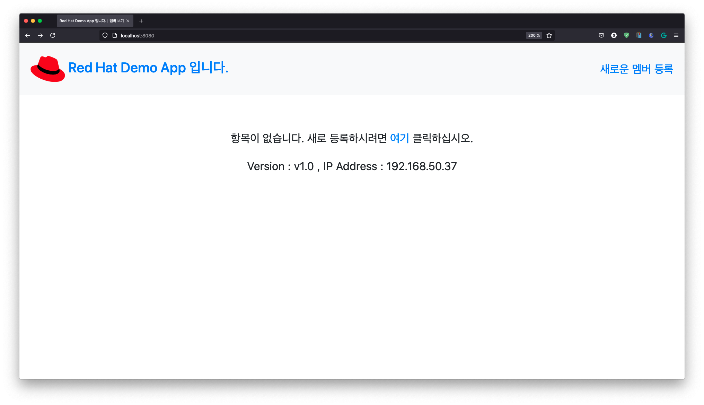
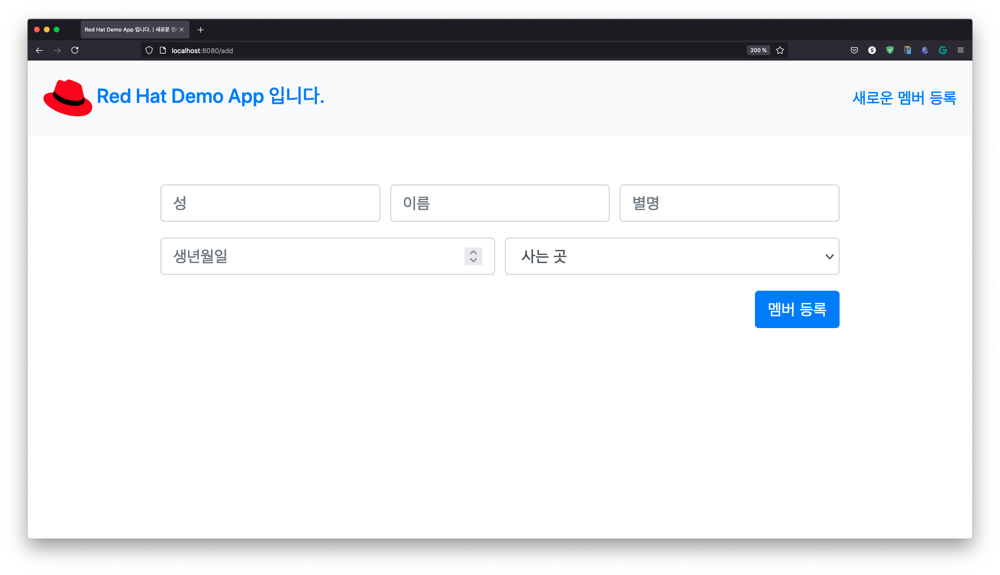
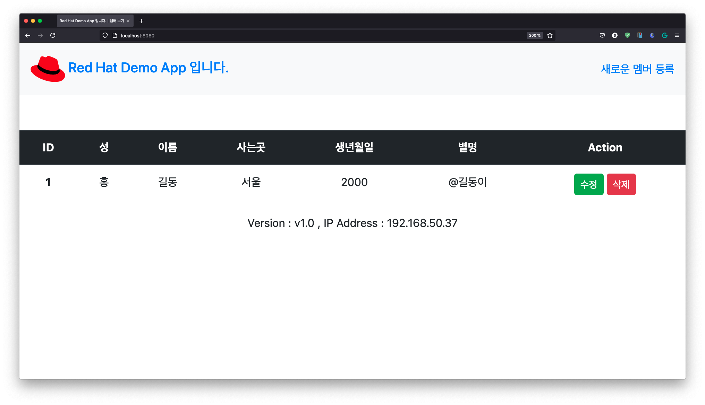

# 애플리케이션 작성하기

데모로 사용할 애플리케이션은 다음과 같은 애플리케이션입니다.  
MySQL을 데이터베이스로 사용하고 Node.js로 만들어진 간단한 애플리케이션입니다.

## 사전 요구사항
- Docker
- Node.js
- Git

## 애플리케이션

1. 애플리케이션을 작성합니다. (기존 소스를 클론합니다.) 

    ~~~sh
    git clone https://github.com/jonggyoukim/openshift-cicd-demo
    ~~~

    ~~~sh
    cd openshift-cicd-demo
    ~~~

1. 필요한 패키지를 설치하고 애플리케이션을 실행합니다.

    ~~~sh
    npm install
    ~~~

    ~~~sh
    npm start
    ~~~

    애플리케이션을 실행하면 접속한 MySQL 데이터베이스가 없어서 오류가 날 것입니다.

    ~~~sh
    > oke-sample-app@1.0.0 start
    > node app.js

    host:undefined
    user:undefined
    password:undefined
    database:undefined
    Server running on port: 8080
    /Users/jonggkim/RedHat/cicd/openshift-cicd-demo/app.js:30
            throw err;
            ^

    Error: connect ECONNREFUSED 127.0.0.1:3306
        at TCPConnectWrap.afterConnect [as oncomplete] (node:net:1133:16)
        --------------------
        at Protocol._enqueue (/Users/jonggkim/RedHat/cicd/openshift-cicd-demo/node_modules/mysql/lib/protocol/Protocol.js:144:48)
        at Protocol.handshake (/Users/jonggkim/RedHat/cicd/openshift-cicd-demo/node_modules/mysql/lib/protocol/Protocol.js:51:23)
        at Connection.connect (/Users/jonggkim/RedHat/cicd/openshift-cicd-demo/node_modules/mysql/lib/Connection.js:116:18)
        at Object.<anonymous> (/Users/jonggkim/RedHat/cicd/openshift-cicd-demo/app.js:28:4)
        at Module._compile (node:internal/modules/cjs/loader:1109:14)
        at Object.Module._extensions..js (node:internal/modules/cjs/loader:1138:10)
        at Module.load (node:internal/modules/cjs/loader:989:32)
        at Function.Module._load (node:internal/modules/cjs/loader:829:14)
        at Function.executeUserEntryPoint [as runMain] (node:internal/modules/run_main:76:12)
        at node:internal/main/run_main_module:17:47 {
    errno: -61,
    code: 'ECONNREFUSED',
    syscall: 'connect',
    address: '127.0.0.1',
    port: 3306,
    fatal: true
    }
    ~~~

    MySQL은 로컬에 설치하지 않고 컨테이너로 띄울 것이며 이를 위하여 Docker를 사용합니다.

## Docker

1. Docker 로그인

    컨테이너 이미지를 받기 위해서 먼저 docker hub에 로그인 합니다.
    만약 아이디/패스워드가 없으면 hub.docker.com 에서 만듭니다.

    ~~~sh
    docker login
    ~~~

1. Docker Network 생성

    애플리케이션을 컨테이너로 만들면 컨테이너간 통신을 위해서 Docker Network가 필요합니다. 다음 절차에서 애플리케이션을 컨테이너로 테스트 하기 때문에 미리 아래의 MySQL을 네트워크에 포함시키기 위하여 미리 Docker Network를 만듭니다.

    ~~~sh
    docker network create mynet
    ~~~

## MySQL

1. MySQL 실행

    컨테이너로 실행되는 MySQL에서 데이터를 영구저장 하기 위해서는 볼륨에 저장을 해야 하나, 별도의 볼륨 지정 없이 테스트를 위해서 컨테이너를 안에 데이터를 저장하도록 합니다.  

    ~~~sh
    docker run --name mydb --network mynet -e MYSQL_ROOT_PASSWORD=mypassword -p 3306:3306 -d mysql:5.6
    ~~~

    - 컨테이너 이름 : mydb
    - 컨테이너 네트워크 : mynet
    - MySQL 루트 패스워드 : mypassword
    - 호스트포트:컨테이너포트 : 3306:3306
    - 백그라운드로 실행

    잘 실행되고 있는지 검사합니다.

    ~~~
    docker ps
    ~~~

    다음과 같은 결과로 잘 실행되고 있음을 알 수 있습니다.
    ~~~
    CONTAINER ID   IMAGE       COMMAND                  CREATED         STATUS         PORTS      NAMES
    316762d86e96   mysql:5.6   "docker-entrypoint.s…"   2 minutes ago   Up 2 minutes   3306/tcp   mydb
    ~~~

1. 필요 테이블 생성

    이제 애플리케이션이 필요로 하는 테이블을 만듭니다.
    실행중인 MySQL 컨테이너에 접속합니다.
    ~~~
    docker exec -it mydb /bin/sh
    ~~~

    컨테이너의 */bin/sh* 이 실행되는 것이며, 프롬프트 `'#'` 이 보이면 다음과 같이 입력합니다.
    ~~~
    mysql -u root -p
    ~~~

    `Enter password:` 에는 **"mypassword"** 를 입력하면 다음과 같이 로그인 됩니다.
    ~~~
    Welcome to the MySQL monitor.  Commands end with ; or \g.
    Your MySQL connection id is 7
    Server version: 5.6.51 MySQL Community Server (GPL)

    Copyright (c) 2000, 2021, Oracle and/or its affiliates. All rights reserved.

    Oracle is a registered trademark of Oracle Corporation and/or its
    affiliates. Other names may be trademarks of their respective
    owners.

    Type 'help;' or '\h' for help. Type '\c' to clear the current input statement.

    mysql> 
    ~~~

    이제 애플리케이션이 필요로 하는 데이터베이스, 사용자 정보, 테이블을 만든다. 아래에 있는 명령을 복사하여 실행합니다.
    ~~~sql
    CREATE USER 'test'@'%' IDENTIFIED BY 'Welcome1';

    GRANT USAGE ON *.* TO 'test'@'%';

    GRANT ALL PRIVILEGES ON *.* TO 'test'@'%';

    CREATE DATABASE sample DEFAULT CHARACTER SET utf8 COLLATE utf8_general_ci;

    USE sample;

    CREATE TABLE IF NOT EXISTS `players` (
    `id` int(5) NOT NULL AUTO_INCREMENT,
    `first_name` varchar(255) NOT NULL,
    `last_name` varchar(255) NOT NULL,
    `position` varchar(255) NOT NULL,
    `number` int(11) NOT NULL,
    `user_name` varchar(20) NOT NULL,
    PRIMARY KEY (`id`)
    ) ENGINE=InnoDB  AUTO_INCREMENT=1;
    ~~~

    mysql 과 container를 빠져나온다. `'#'`프롬프트가 없어질 때 까지 exit 한다.
    ~~~
    exit
    ~~~

## 애플리케이션

1. 애플리케이션 실행

    애플리케이션을 다시 실행 해 봅니다.
    ~~~
    npm start
    ~~~
    다음과 같이 오류없이 애플리케이션이 실행되었습니다.
    ~~~

    > openshift-cicd-demo@1.0.0 start
    > node app.js

    host:undefined
    user:undefined
    password:undefined
    database:undefined
    Server running on port: 8080
    Connected to database
    ~~~

1. 애플리케이션 접근

    이제 http://localhost:8080 으로 접속을 해 봅니다.

    

    
    
    

    주의깊게 볼 항목은 화면 중앙의 
    ~~~
    Version : v1.0 , IP Address : 192.168.50.37
    ~~~
    부분으로 현재 IP는 `192.168.50.37`로 로컬 컴퓨터의 IP를 나타내고 있습니다.

---

여기까지 "애플리케이션 작성하기" 를 완료하였습니다.

다음은 애플리케이션을 컨테이너 이미지로 만들어 보겠습니다. 

<FORM> 
<INPUT type="button" value="첫 화면으로" onClick="history.back()">
</FORM>
