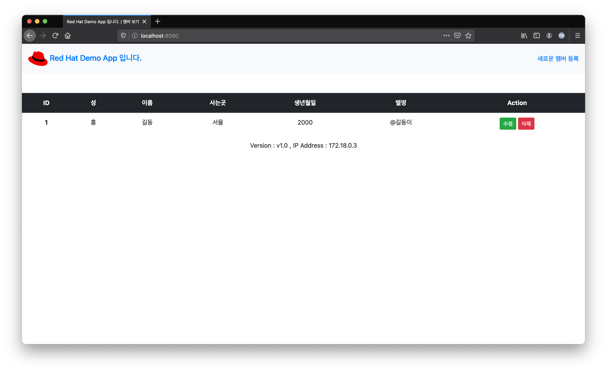

# 애플리케이션을 컨테이너 이미지로 만들기

Docker를 이용하여 애플리케이션을 컨테이너로 만들기 위해서는 Dockerfile이라는 Description이 필요합니다.

Dockerfile에는 컨테이너를 만들기 위한 절차가 포함되어 있습니다.
아래는 소스에 포함된 `Dockerfile` 의 내용입니다.

~~~docker
# Node 이미지를 기본으로 합니다.
FROM node:latest

# 모든 애플리케이션 파일을 복사합니다.
COPY . .

# npm을 이용하여 필요한 패키지를 설치합니다.
RUN npm install

# 포트를 익스포즈 합니다.
EXPOSE 8080

# 애플리케이션를 실행합니다.
CMD ["npm", "start"]
~~~

1. 컨테이너 확인

현재 실행중인 컨테이너를 확인합니다.
~~~sh
$ docker ps

CONTAINER ID   IMAGE       COMMAND                  CREATED             STATUS             PORTS                                       NAMES
9d9b7bebba57   mysql:5.6   "docker-entrypoint.s…"   About an hour ago   Up About an hour   0.0.0.0:3306->3306/tcp, :::3306->3306/tcp   mydb
~~~
현재 MySQL이 운영되고 있음을 알 수 있습니다.

컨테이너 이미지를 확인합니다.
~~~sh
$ docker images

REPOSITORY   TAG       IMAGE ID       CREATED       SIZE
mysql        5.6       e1aa75e199d7   13 days ago   303MB
~~~
좀 전에 실행했던 mysql의 이미지가 로컬에 있음을 알 수 있습니다.

1. 애플리케이션을 컨테이너화 합니다.

> 아이디의 일반화를 위한 DOCKER_USER 로 변수를 지정합니다. hub.docker.com의 로그인 아이디를 변수값으로 대입합니다.
> ~~~
> export DOCKER_USER=jonggyoukim
> ~~~

`docker build` 명령을 사용하여 컨테이너를 만듭니다. 기본적으로 지정된 디렉토리의 Dockerfile을 참조하여 컨테이너를 만듭니다.

~~~sh
docker build -t $DOCKER_USER/member-app .
~~~

이미지 이름 앞에 Docker의 사용자 아이디가 있어야 나중에 이미지를 업로드 할 때 자신의 레파지토리에 컨테이너가 들어가게 됩니다.

아래와 같이 로그가 나오면서 이미지가 만들어지게 됩니다.

~~~
[+] Building 33.1s (9/9) FINISHED                                                                                                                                                                
 => [internal] load build definition from Dockerfile   
 => transferring dockerfile: 375B
 => [internal] load .dockerignore
 => transferring context: 2B
 => [internal] load metadata for docker.io/library/node:latest
 => [auth] library/node:pull token for registry-1.docker.io
 => [internal] load build context
 => transferring context: 5.04MB
 => [1/3] FROM docker.io/library/node:latest@sha256:197b6d54b6ca2084936e26e57778c7e01762f53bfb5959a389757ce1f8de889b
 => resolve docker.io/library/

 ...
 
 => [2/3] COPY . .
 => [3/3] RUN npm install
 => exporting to image
 => => exporting layers
 => => writing image sha256:663d760a9d4c93d62eb42cb1e5dbf33928965ba35c2a889cdd1847acfaa33412 
 => => naming to docker.io/jonggyoukim/member-app

Use 'docker scan' to run Snyk tests against images to find vulnerabilities and learn how to fix them
~~~

이미지가 잘 만들어졌는지 확인합니다.
~~~
$ docker images

REPOSITORY               TAG       IMAGE ID       CREATED         SIZE
jonggyoukim/member-app   latest    663d760a9d4c   7 minutes ago   913MB
mysql                    5.6       e1aa75e199d7   13 days ago     303MB
~~~

1. 애플리케이션 컨테이너 실행

만들어진 컨테이너 이미지를 실행합니다.
- 컨테이너 이름 : myapp
- 컨테이너 네트워크 : mynet
- MYSQL_SERVICE_HOST : mydb (MySQL이 mydb라는 이름으로 운영 중)
- 호스트포트:컨테이너포트 : 8080:8080
- 백그라운드 실행

~~~sh
docker run --name myapp --network mynet -e MYSQL_SERVICE_HOST=mydb -p 8080:8080 -d jonggyoukim/member-app
~~~

> 만약 어떤 이유로 myapp 이라는 이름으로 한번 실행된 컨테이너가 있다면 삭제를 하고 다시 실행시키면 됩니다.
>~~~
>docker stop myapp; docker rm myapp
>~~~

컨테이너가 실행이 성공되고, 다시 http://localhost:8080으로 접속을 해 봅니다.

기존 데이터가 그대로 남있고 애플리케이션도 동일하게 동작함을 알 수 있습니다.

주의깊게 볼 항목은 화면 중앙의 
~~~
Version : v1.0 , IP Address : 172.18.0.3
~~~
부분으로 기존 IP는 `10.208.192.120`에서 `172.18.0.3`으로 바뀐 것을 알 수 있습니다. 이는 로컬 컴퓨터의 IP가 아닌 컨테이너가 부여받은 IP를 나타내고 있습니다.

---

이상 "애플리케이션을 컨테이너 이미지로 만들기"를 완료하였습니다.

다음은 만들어진 애플리케이션 컨테이너를 쿠버네티스에 배포해 보겠습니다. 

<FORM> 
<INPUT type="button" value="첫 화면으로" onClick="history.back()">
</FORM>

