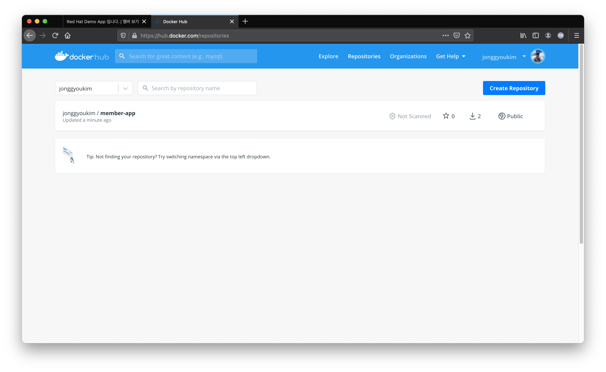
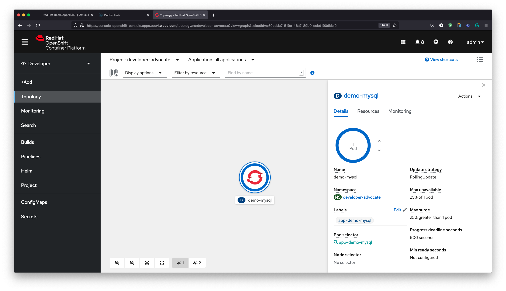
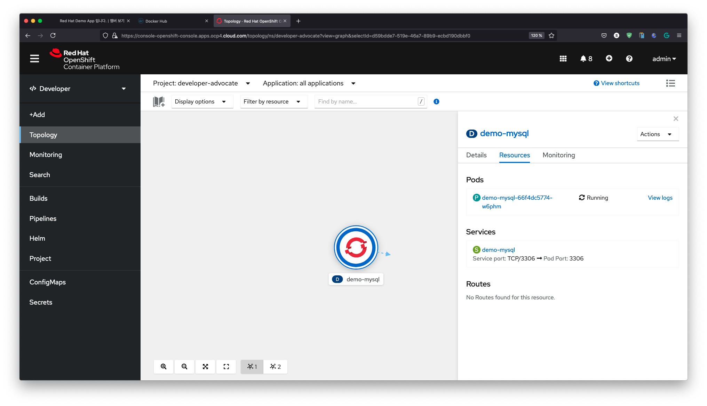
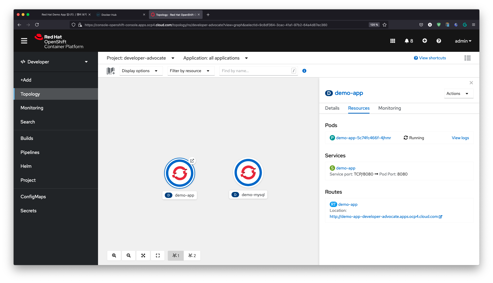
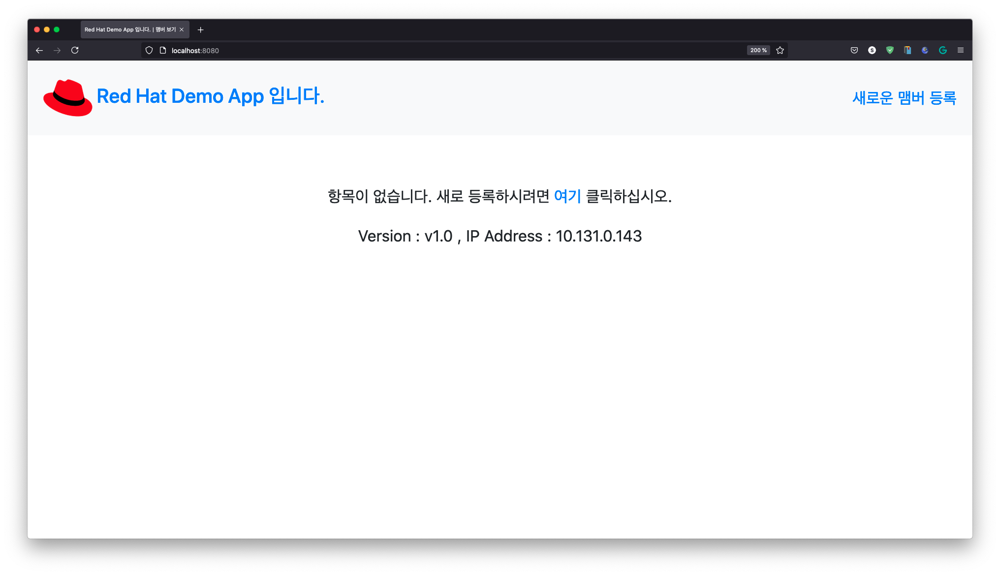
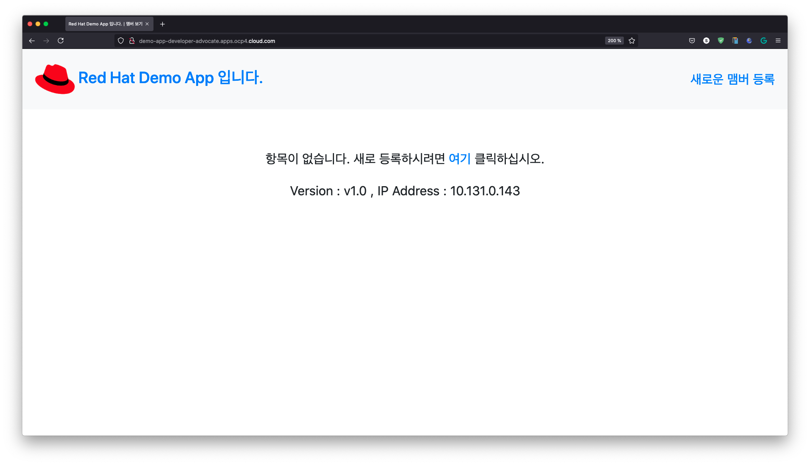

# 애플리케이션을 쿠버네티스에 배포하기 (yaml 파일 사용)

지금까지 애플리케이션을 작성하고, 해당 애플리케이션을 컨테이너화를 했습니다.  
이번 단계는 애플리케이션을 쿠버네티스에 배포하는 단계입니다.

>애플리케이션의 배포는 CI/CD Pipeline을 통해 쉽게 쿠버네티스에 배포 가능합니다.   
>이번 세션에서는 Yaml 파일을 통한 배포를 하도록 하겠습니다.

## 사전 요구사항

- docker login
- Kubernetes Cluster ([OpenShift](https://developers.redhat.com/products/openshift/download), [minikube](https://minikube.sigs.k8s.io/docs/start/), 등)
- [kubectl](https://kubernetes.io/docs/tasks/tools/)

## 컨테이너 이미지를 컨테이너 저장소에 넣기

쿠버네티스는 컨테이너 저장소에서 컨테이너를 클러스터에 배포를 합니다. 그래서 이 전 세션에서 만들었던 이미지를 컨테이너 저장소에 넣는 작업이 필요합니다.

컨테이너 저장소는 여러가지가 있습니다. docker.io 나 registry.access.redhat.com 같이 public 저장소도 있고 자체 네트워크에서 구성하는 private 저장소도 있습니다. 

1. docker login

    본 세션에서는 docker.io를 사용하기 위해서 docker.io에 로그인이 필요합니다.

    ~~~sh
    docker login
    ~~~
    >docker.io에서 아이디를 새로 만들 수 있습니다. 아이디를 새로 만드셨다면 반드시 email을 확인하셔서 검증하십시오.

1. docker push

    그리고 이 전 세션에서 만들었던 컨테이너 이미지를 push 합니다.
    ~~~sh
    docker push $DOCKER_USER/member-app
    ~~~~

    아래와 같이 진행되어 완료되게 됩니다.
    ~~~sh
    Using default tag: latest
    The push refers to repository [docker.io/jonggyoukim/member-app]
    dc6a1c37fcb2: Pushed 
    e9354aaf0747: Pushed 
    3d7859fc32bc: Mounted from library/node 
    d702bac94b3c: Mounted from library/node
    7e84055b0824: Mounted from library/node 
    08592983d1e9: Mounted from library/node 
    cdc9dae211b4: Mounted from library/node 
    7095af798ace: Mounted from library/node 
    fe6a4fdbedc0: Mounted from library/node 
    e4d0e810d54a: Mounted from library/node 
    4e006334a6fd: Mounted from library/node 
    latest: digest: sha256:e110f145b2fedc0f2bb5960032c67f61c3c10da0780b465bb2135f4836e5a2df size: 2635
    ~~~

    브라우저를 통해 docker.io/jonggyoukim 을 살펴보면 다음과 같습니다.

    

## YAML 파일

쿠버네티스는 yaml description을 사용합니다.  
미리 만들어 놓은 yaml 파일을 접근하기 위해서 yaml 디렉토리로 이동합니다.
~~~sh
cd yaml
~~~

## MySQL

기존 로컬에서와 애플리케이션은 MySQL을 필요로 합니다. 그래서 쿠버네티스 클러스터에 배포해 보겠습니다. 

이 전과 마찬가지로 데이터의 영구저장을 위해서는 Persistant 볼륨이 필요합니다. 쿠버네티스에서는 PersistentVolume(PV) 와 PersistentVolumeClaim(PVC)로 구성 되지만, 본 세션에서는 그냥 컨테이너에 저장하도록 합니다. 이렇게 하면 당연한 얘기지만 Pod가 사라지면 데이터도 사라지게 됩니다.

1. YAML 

    다음은 MySQL의 배포를 위한 deployment-mysql.yaml 파일입니다. 

    ~~~yaml
    apiVersion: apps/v1
    kind: Deployment
    metadata:
      name: demo-mysql
      labels:
        app: demo-mysql
    spec:
      selector:
        matchLabels:
          app: demo-mysql

      template:
        metadata:
          labels:
            app: demo-mysql
        spec:
          containers:
          - name: demo-mysql
            image: mysql:5.6
            env:
            - name: MYSQL_ROOT_PASSWORD
              value: mypassword
            ports:
            - containerPort: 3306
    ~~~
    - 배포하는 이미지는 `mysql:5.6`으로 지정
    - 환경변수로 MySQL에 루트 패스워드 지정을 위한 MYSQL_ROOT_PASSWORD 변수에 대한 값으로 `mypassword` 지정
    - 포트는 3306 지정

1. Deployment 생성

    해당 yaml 파일을 사용하여 쿠버네티스에 배포하도록 합니다.

    ~~~sh
    $ kubectl apply -f deployment-mysql.yaml

    deployment.apps/demo-mysql created
    ~~~

    잘 배포 되었고 실행중인지 확인합니다.

    ~~~sh
    $ kubectl get deployment demo-mysql

    NAME         READY   UP-TO-DATE   AVAILABLE   AGE
    demo-mysql   1/1     1            1           2m32s
    ~~~

    실제 실행중인 pod를 살펴봅니다. 많은 pod 중에 MySQL에 대한 항목만 보기 위하여 deployment-mysql.yaml에 정의된 label을 주어 필터링 합니다.

    ~~~sh
    $ kubectl get pod --selector=app=demo-mysql

    NAME                          READY   STATUS    RESTARTS   AGE
    demo-mysql-66f4dc5774-w6phm   1/1     Running   0          4m5s
    ~~~

1. 테이블 설정

    수행중인 컨테이너에 접속을 합니다. 현재 pod에 1개의 컨테이너만 수행되기 때문에 pod 명으로 접속을 합니다.

    ~~~
    $ kubectl exec -it demo-mysql-66f4dc5774-w6phm -- /bin/sh

    $
    ~~~

    이 전과 같이 MySQL에 접속하여 애플리케이션이 사용할 아이디, 데이터베이스, 테이블을 만들어줍니다.
    패스워드는 deployment-mysql.yaml 에 정의한 `mypassword`를 입력합니다.
    ~~~
    $ mysql -u root -p

    Enter password:
    Welcome to the MySQL monitor.  Commands end with ; or \g.
    Your MySQL connection id is 1
    Server version: 5.6.51 MySQL Community Server (GPL)

    Copyright (c) 2000, 2021, Oracle and/or its affiliates. All rights reserved.

    Oracle is a registered trademark of Oracle Corporation and/or its
    affiliates. Other names may be trademarks of their respective
    owners.

    Type 'help;' or '\h' for help. Type '\c' to clear the current input statement.

    mysql> CREATE USER 'test'@'%' IDENTIFIED BY 'Welcome1';
    Query OK, 0 rows affected (0.00 sec)

    mysql>
    ~~~

    접속 완료 후 다음의 SQL을 수행합니다.
    ~~~sql
    CREATE USER 'test'@'%' IDENTIFIED BY 'Welcome1';

    GRANT USAGE ON *.* TO 'test'@'%';

    GRANT ALL PRIVILEGES ON *.* TO 'test'@'%';

    CREATE DATABASE sample DEFAULT CHARACTER SET utf8 COLLATE utf8_general_ci;

    USE sample;

    CREATE TABLE IF NOT EXISTS `players` (
    `id` int(5) NOT NULL AUTO_INCREMENT,
    `first_name` varchar(255) NOT NULL,
    `last_name` varchar(255) NOT NULL,
    `position` varchar(255) NOT NULL,
    `number` int(11) NOT NULL,
    `user_name` varchar(20) NOT NULL,
    PRIMARY KEY (`id`)
    ) ENGINE=InnoDB  AUTO_INCREMENT=1;
    ~~~

    `exit`를 입력하여 mysql 및 컨테이너를 빠져나옵니다.

1. Service 생성

    이번에는 배포된 MySQL을 다른 Pod가 사용할 수 있도록 Service를 생성합니다. 클러스터 내의 애플리케이션이 접속하므로 ClusterIP면 다른 Pod가 접속 가능합니다.  Service의 기본 타입이 ClusterIP 입니다.  
    아래는 서비스 배포를 위한 service-mysql.yaml 파일입니다.
    ~~~yaml
    apiVersion: v1
    kind: Service
    metadata:
      name: demo-mysql
      labels:
        app: demo-mysql
    spec:
      ports:
      - port: 3306
        targetPort: 3306
      selector:
        app: demo-mysql
    ~~~

    **demo-mysql** 이라는 name으로 Service를 생성합니다.

    ~~~sh
    $ kubectl apply -f service-mysql.yaml

    service/demo-mysql configured
    ~~~

1. OpenShift Console

    OpenShift의 브라우저에서 Console에서는 다음과 같이 정보를 볼 수 있습니다.

    

    

## 애플리케이션

1. YAML

    아래는 MySQL을 배포한 것과 마찬가지로 애플리케이션 배포를 위한 deployment-app.yaml 입니다.  
    ~~~yaml
    apiVersion: apps/v1
    kind: Deployment
    metadata:
      name: demo-app
      labels:
        app: demo-app
    spec:
      selector:
        matchLabels:
          app: demo-app

      template:
        metadata:
          labels:
            app: demo-app
        spec:
          containers:
          - name: demo-app
            image: jonggyoukim/member-app  
            env:
            - name: MYSQL_SERVICE_HOST
              value: demo-mysql
            ports:
            - containerPort: 8080
              name: demo-app
    ~~~

    - 배포하는 이미지는 `jonggyoukim/member-app`로 지정
    - 환경변수로 MySQL에 접근하기 위한 MYSQL_SERVICE_HOST 변수에 대한 값으로 `demo-mysql`이 지정
    - 포트는 8080 지정

    설정중에 MYSQL_SERVICE_HOST 의 값인 `demo-mysql`은 MySQL의 Service name입니다.

1. Deployment 생성

    ~~~
    $ kubectl apply -f deployment-app.yaml

    deployment.apps/demo-app created
    ~~~

    ~~~
    $ kubectl get pod --selector=app=demo-app

    NAME                        READY   STATUS    RESTARTS   AGE
    demo-app-5c74fc466f-4jhmr   1/1     Running   0          12s
    ~~~

    ~~~
    $ kubectl logs demo-app-5c74fc466f-4jhmr

    > openshift-cicd-demo@1.0.0 start
    > node app.js

    host:demo-mysql
    user:undefined
    password:undefined
    database:undefined
    Server running on port: 8080
    Connected to database
    ~~~

1. OpenShift Console

    OpenShift의 브라우저에서 Console에서는 다음과 같이 정보를 볼 수 있습니다.

    

    

## 애플리케이션 접근

### kubectl port-forward 로 접근

애플리케이션이 동작하고 있는 Pod의 포트를 바로 접근 가능할 수 있는 port-forward로 접근가능합니다.

1. port forward

    port-forward를 통해서 localhost의 port로 Pod의 port로 접근가능하게 합니다.  
    ~~~kubectl
    $ kubectl port-forward demo-app-5c74fc466f-4jhmr 8080:8080

    Forwarding from 127.0.0.1:8080 -> 8080
    Forwarding from [::1]:8080 -> 8080
    ~~~

1. 애플리케이션 접근

    웹브라우저에서 http://localhost:8080 으로 접속해 봅니다.

    

    현재 IP가 10.131.0.143으로 나오는데, 이는 Pod가 부여받은 IP를 나타내고 있습니다.

    실제 Pod의 IP를 살펴보려면 다음과 같이 확인 할 수 있습니다.
    ~~~sh
    $ kubectl describe pod demo-app-5c74fc466f-4jhmr | grep IP

    IP:           10.131.0.143
    IPs:
      IP:           10.131.0.143  
    ~~~

### OpenShift Route 접근

OpenShift에서는 애플리케이션을 외부로 서비스 하기 위하여 Route라는 CRS를 제공합니다.
OpenShift Route는 www.example.com과 같이 외부에서 연결할 수있는 호스트 이름을 제공하여 서비스를 노출하는 방법입니다. 외부 클라이언트가 애플리케이션에 도달 할 수 있도록 Serice name으로 명명된 연결을 제공합니다.

1. Service 생성

    아래는 애플리케이션의 Service 에 대한 service-app.yaml 입니다.
    ~~~
    apiVersion: v1
    kind: Service
    metadata:
      name: demo-app
      labels:
        app: demo-app
    spec:
      ports:
      - port: 8080
        targetPort: 8080
      selector:
        app: demo-app
    ~~~

    먼저 Service를 생성합니다.
    ~~~
    $ kubectl apply -f service-app.yaml

    service/demo-app created
    ~~~

1. Route 생성

    그리고 Route를 생성합니다.
    ~~~
    $ oc expose svc/demo-app

    route.route.openshift.io/demo-app exposed
    ~~~

    생성된 Route의 HOST를 확인합니다.
    ~~~
    $ oc get route demo-app

    NAME       HOST/PORT                                         PATH   SERVICES   PORT   TERMINATION   WILDCARD
    demo-app   demo-app-developer-advocate.apps.ocp4.cloud.com          demo-app   8080                 None
    ~~~

1. 애플리케이션 접근

    브라우저로 http://demo-app-developer-advocate.apps.ocp4.cloud.com 에 접속합니다.

    

    동일한 Pod을 접근할 수 있음을 알 수 있습니다.

### External IP 로 접근

1. LoadBalancer

    LoadBalancer에서 제공하는 External IP로 Service를 접근 가능합니다.
    이는 yaml 파일에서 `type: LoadBalancer` 로 정의하면 됩니다.
    ~~~yaml
    ...
    spec:
      ports:
      - port: 8080
        targetPort: 8080
      selector:
        app: demo-app
      type: LoadBalancer
    ~~~

1. Pending

    하지만 LoadBalancer가 쿠버네티스 클러스터에 포함되지 않으면 External IP를 부여받지 못해서 서비스를 할 수 없으며 아래와 같이 Service의 상태가 `EXTERNAL-IP`부분에서 `<pending>`으로 됩니다.

    ~~~
    $ kubectl get svc demo-app

    NAME       TYPE           CLUSTER-IP       EXTERNAL-IP   PORT(S)          AGE
    demo-app   LoadBalancer   172.30.112.154   <pending>     8080:31130/TCP   4m13s
    ~~~
    이런 경우는 `type: LoadBalancer`을 사용하지 않아야 합니다.

---

여기까지 "애플리케이션을 쿠버네티스에 배포하기"를 완료하였습니다.

다음은 자동화된 배포를 위한 CI/CD Pipeline 에 대해 알아보겠습니다.

<FORM> 
<INPUT type="button" value="첫 화면으로" onClick="history.back()">
</FORM>
